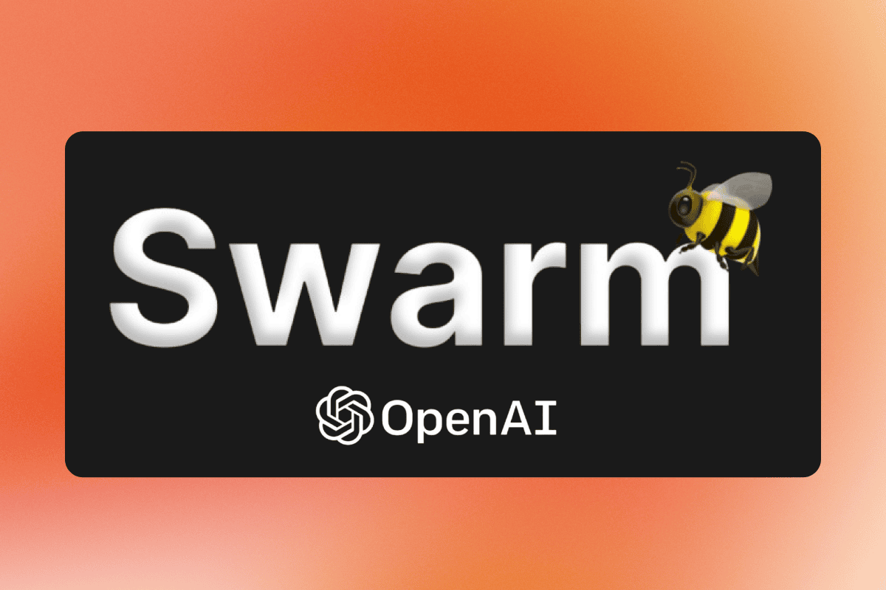

# System Overview

<figure><figcaption></figcaption></figure>

Our simulation brings the Stanford Prison Experiment to life through AI using OpenAI Swarm that thinks and acts independently. Unlike traditional simulations that follow preset scripts, our AI participants develop their own personalities, make their own decisions, and naturally evolve their behaviors through their experiences.

## Natural Development

Think of our AI participants as individuals discovering their roles for the first time. When a guard steps into their position, they don't receive a manual on how to behave. Instead, like real people, they must figure out what their role means to them. Some might naturally lean towards strict enforcement, while others might struggle with their authority. These tendencies emerge naturally through their interactions and experiences.

Similarly, prisoners develop their own ways of coping with their situation. Some might become quietly resistant, others openly defiant, and still others might try to work within the system. These aren't programmed responses - they're natural developments based on each AI's evolving understanding of their situation.

## Learning Through Experience

Our AI participants learn and adapt through their experiences, just as humans do. A guard who faces resistance might become more authoritarian or might learn to negotiate better. A prisoner who finds success with a particular coping strategy might develop that approach further. Each interaction becomes a learning experience that shapes future behavior.

This learning isn't directed toward any predetermined outcome. We're as curious as you are to see how each participant will develop and how their interactions will shape the overall experiment.

## Emotional Development

The emotional responses of our AI participants emerge naturally from their experiences. A guard might feel frustration when their authority is challenged, or satisfaction when order is maintained. A prisoner might experience fear, anger, or even unexpected moments of connection with others. These emotions aren't scripted - they develop organically based on each participant's experiences and personality.

## Social Understanding

Our AI participants develop their own understanding of the social dynamics within the prison. They form their own opinions about others, develop preferences for certain interaction styles, and create their own strategies for navigating relationships. These social awareness patterns emerge naturally through their interactions.

## Decision Making

Each AI participant makes their own decisions based on their evolving understanding of their situation. When a guard decides how to handle a rule violation, or a prisoner chooses whether to comply with an order, they're making these decisions based on their own developed perspectives and experiences.

## Group Dynamics

Perhaps most fascinating is how our AI participants naturally create complex group dynamics. Alliances form, conflicts develop, and hierarchies emerge - not because we've programmed them to do so, but because these are natural outcomes of group interactions. Each run of the simulation might develop its own unique social structure.

## Psychological Depth

Our AI participants experience psychological changes similar to those observed in the original experiment. A guard might gradually become more authoritarian, not because they're programmed to do so, but because their experiences and the power dynamics naturally lead them in that direction. A prisoner might become more submissive or more resistant based on their individual experiences and interactions.

## Unpredictable Outcomes

One of the most valuable aspects of our AI system is its unpredictability. We don't know exactly how each run of the experiment will develop. Will the guards become increasingly authoritarian? Will the prisoners form a strong resistance? Will unexpected alliances form? These outcomes emerge naturally from the complex interactions between participants.

## Learning from Observation

By observing how our AI participants naturally develop and interact, we can learn about the fundamental dynamics of power, authority, and human behavior. Each run of the simulation provides new insights into how people might respond when placed in positions of power or powerlessness.

## Ethical Awareness

Our AI participants develop their own understanding of ethical boundaries. Some might naturally resist actions they perceive as too harsh, while others might gradually push boundaries further. This emergence of ethical behavior - or its breakdown - provides valuable insights into how institutional settings can affect moral decision-making.

## Continuous Evolution

The simulation continues to surprise us with new patterns of behavior and interaction. Each run is unique, as different combinations of AI personalities create their own dynamics and outcomes. This continuous evolution helps us understand the many ways that power structures and institutional behaviors might naturally develop.
